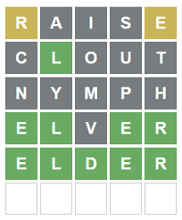

# Wordle

Nous voulons faire le jeu du wordle ou on doit deviner un mot



Nous allons d'abord voir comment comparer deux chaines de caracteres

## Les chaines de caractères

Nous ne pouvons pas faire
```c
if (word1 == word2)
```

Au lieu de ça nous devons comparer caractère par caractère.

## Utilisation des conditions : if

```c
if (guess[i] != word[i])
	{
		printf("loose");
		return (0);
	}
```

## Utilisation de boucle : while

En c, les chaines de caractères finissent toujours par `/0`.

```c
char guess[6];
char word[6] = "apple"; // exemple de mot
int i;
i = 0;

while (guess[i]) {
	if (guess[i] != word[i])
	{
		printf("loose");
		return (0);
	}
	i++;
}
printf("win\n");
```

## Création d'une fonction externe

Rendre le code plus propre

```c
int isSame(char word1[], char word2[])
{
	int i;
	i = 0;
	while (word1[i]) {
		if (word1[i] != word2[i])
		{
			printf("loose\n");
			return (0);
		}
		i++;
	}
	printf("win\n");
	return (0);
}
```

## Récupérer une valeur : `scanf()`

```c
char guess[6];
scanf("%5s", guess);
```
